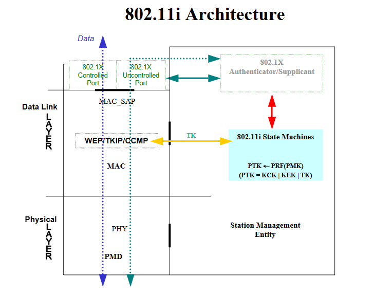
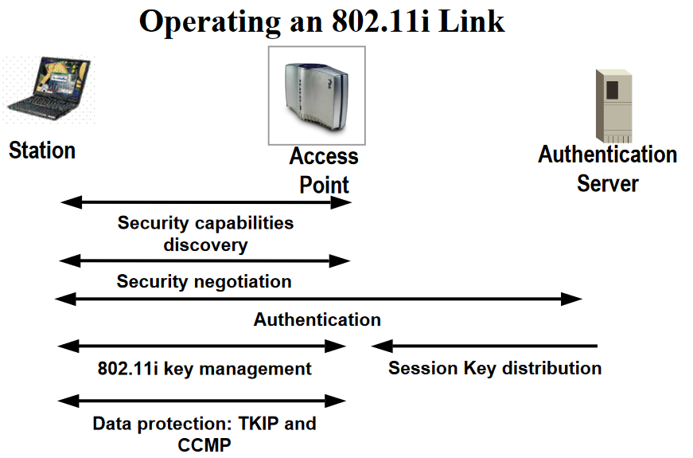
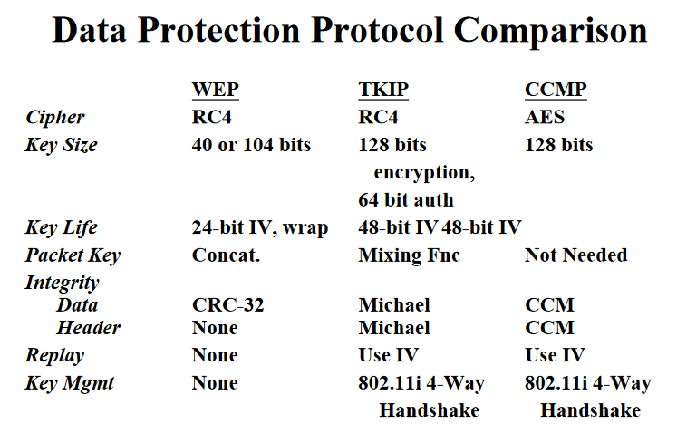
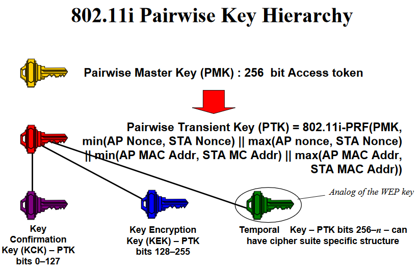
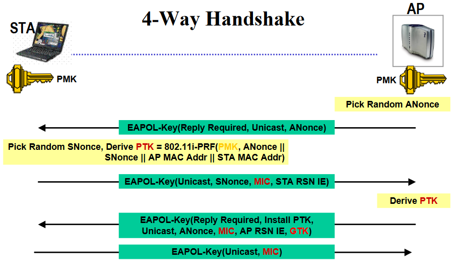

# IEEE 802.11i

## History
* WEP (Wired Equivalent Privacy)
 - first bytes of the output keystream are "strongly non-random" = the break point
* WPA (Wi-Fi Protected Access)
 - RC4 with TKIP (Temporal Key Integrity Protocol)
 - every packet gets unique encryption key
 - implemented a subset of 802.11i
 - **just a short-term workaround, intermediate solution**
* WPA 2
 - began in 2004
 - **AES(Advanced Encryption Standard)** replaced RC4
 - **CCMP(Counter Mode with Cipher Block Chaining Message Authentication Code Protocol)** replaced TKIP
 - WPA2-Enterprise adds 802.1x, ease the administration

## Overview
* implemented as WPA2 in June 2004, also called **RSN(Robust Security Network)**
* it specifies security mechanisms for wireless networks
* **Four-way handshake: 802.11i key management protocol**
* Group key handshake

## Concept
### Basic Structure

### TKIP

### AES-CCMP

### Discovery and Negotiation

### Key Management

### Key Derivation

### 4-Way Handshake

### Group Key Update

## Complementary Standards

### 802.1X

### EAP

### EAP-TLS

### PEAP

## Sourse
[IEEE802.11i overview](http://ieee802.org/16/liaison/docs/80211-05_0123r1.pdf)