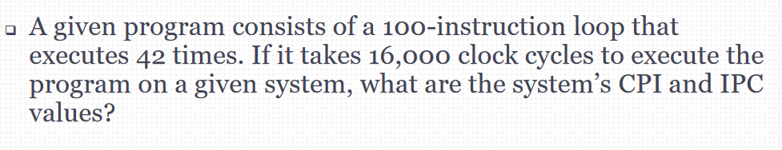

# Digital Data Representation
## Number
* Binary, Decimal, Hexadecimal
* how computer recognize a image
 - store in a 2D array as **pixel**
 - video = many images
* **Be careful with the data type, choose the right one**
* Signed (positive and negative number)
 - sign-magnitude: extra bit in the front, 0 for positive, 1 for negative
 - two's compliment (better than sign-magnitude)
* Store decimal number
## Non-Numeric
* Alphanumeric encodings:
 - ASCII (7 bits)
 - Extended ASCII (8 bits, in C)
 - Unicode (1 to 4 bytes, in Java)
 - EBCDIC
* Colour Representation: RGB
 - color code in hex
 - size = width x height x 3 (3 values in RGB)
* Audio
 - digital signal
# Data Compression
* Well-known coompressed formats
 - JPEG (image)
 - MP3 (audio)
 - MPEG (video)
## Types of compression
* Lossless
 - ex. ZIP files
* Lossy
 - ex. low quality image, audio, video
 - compression ratio = size before/size after

# Basic Computer Architecture
* CPU 
* Memory
* Input/Output Devices
* System Bus
 - Data Bus: characteristics of CPU
 - Address Bus
 - Control Bus 
## Von Neumann Model
* Process
 - instruction fetch
 - instruction decode
 - operand fetch
 - execute
 - result store
 - next instruction
* Memory
 - Random-Access Memory (RAM): contents lost when power removed
  - Dynamic RAM (DRAM): dynamic cells refreshed by electronic charge every few milliseconds
  - Static RAM (SRAM): does not refreshing, used in caching but is more expensive
 - Read-Only Memory (ROM): contents retained when power removed
  - Programmable ROM (PROM): cannot be erased
  - Erasable PROM: erased by UV light
  - Electrically Erasable PROM
 - Flash Memory: USB use it
* Address Bus: identifies which byte of RAM or I/O devices the CPU wishes to address
 - size of the address bus defines the maximum of addressable RAM for CPU
 - If the address bus size is k bits, the maximum RAM is 2^k bytes
* Data Bus: carries the data to and from the CPU, to memory or I/O devices
* Control Bus: contains signals that control the functions of the interconnected components
* System Clock: the signals are used to synchronize the various logic and memory circuits
 - controls the individual steps in:
  - a bus read/write operation
  - executing a CPU instruction

## Technology Trends and Performance Metrics
### Moore's Law
* Number of transistors in an integrated circuit will double about every two years
 - cannot keep going forever
### Computer Performance Metrics
* Ways to measure hardware and software performance
 - Execution time: time between the start and the end of a program
 - Throughput: the amount of work done in a given time
  - measure: MIPS
 - Latency: the time between a request and the response
 - Speedup: a way to compare performance changes/improvements
* CPI: average number cycles of the system clock to execute one instruction
* IPC: average number of instructions that can be executed in one clock cycle

* Sample question:

100 x 42 = 4200 instructions

CPI: 16000 cycles/4200 instructions

IPC: 4200 instructions/16000 cycles

