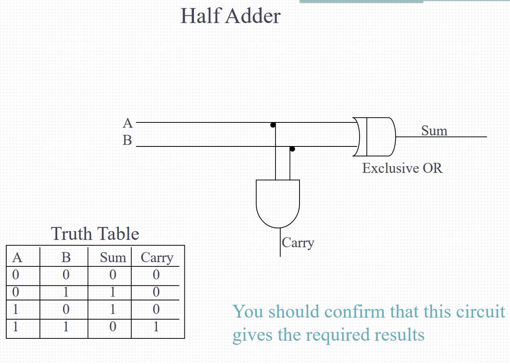
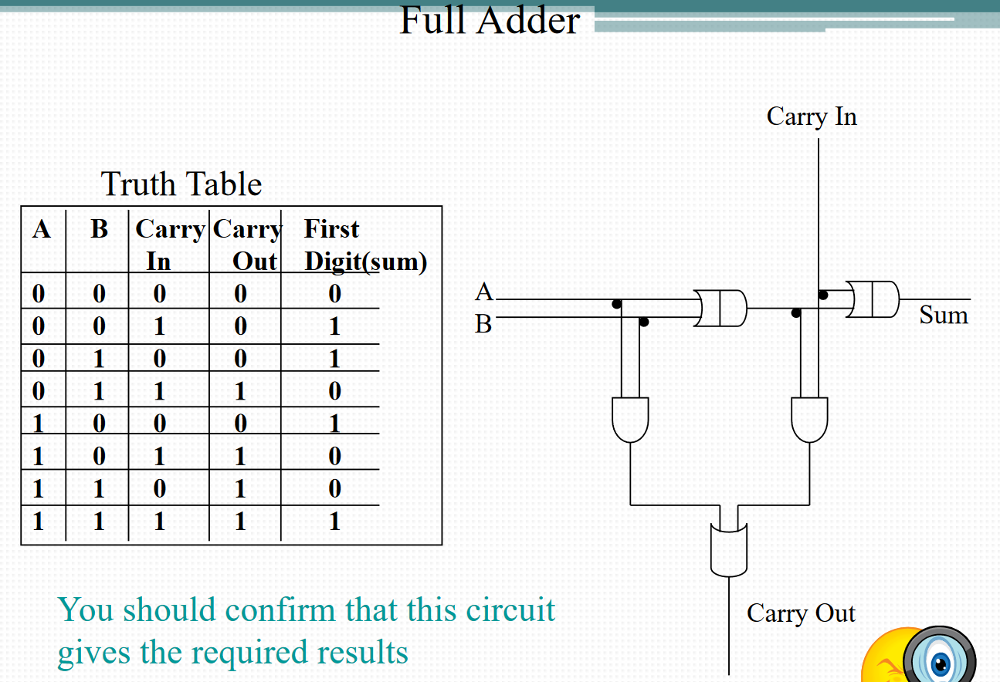

# CPU
## CPU Components
### System Bus Interface Unit
* CPU's connection to the motherboard
* connecting to address and data buses
* Incoming instruction is sent to the Decode Unit
* Incoming data is sent to the Register File
### Decode Unit
* receives machine instructions, then decode them into micro instructions
### Register File (expansive onto main memory)
* Two types: 
### Executing Unit (or Arithmetic-Logic Unit)
* performs arithmetic and boolean logic operations using digital logic circuits
* Operation: 
 - ADD
 - AND
 - OR
 - NOT
### Control Unit
* Controls the functionality of the various components
### Matrics to Compart Architectures
* Architectural Model
 - Von Neumann? CISC (Complex instruction set computer)/RISC(Reduced instruction set computer)? (**full name for midterm question!!!**)
* The Register File
* The Instruction Set
* The data types supported
* The Executing Units

# Logic Circuits
## Adder
* Half Adder

* Full Adder

* two bit adder: connect carry out to carry in

# Quiz
* chip size = 32 bit, control bus = 6 bit
 - data bus = 32 bit, address bus = 32 bit
* 