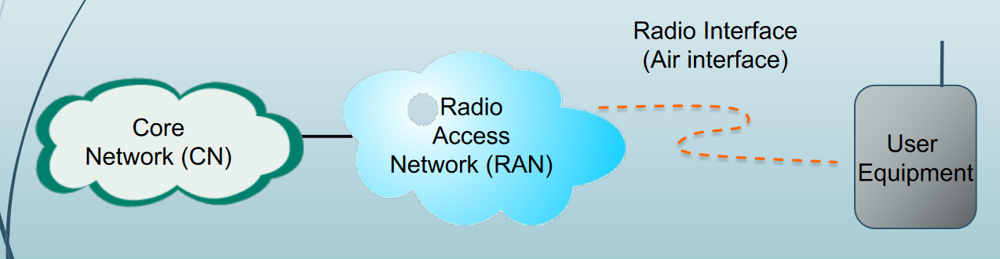
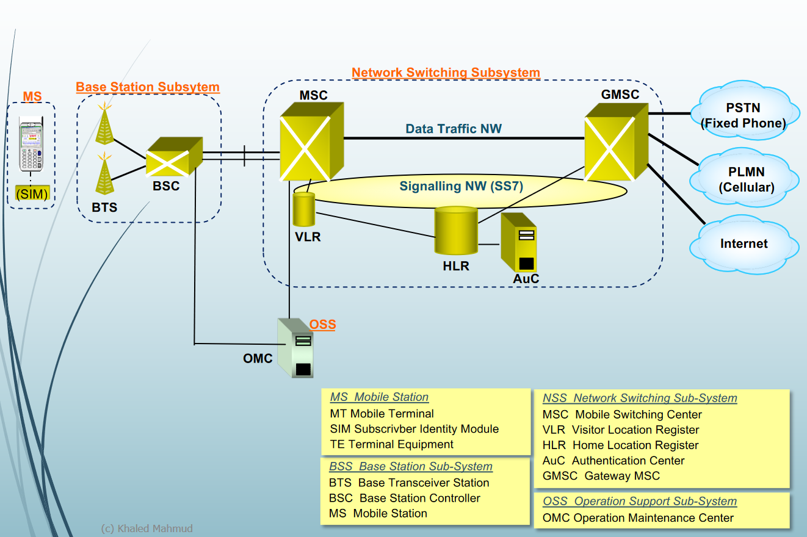

# Wireless Connectivity Characteristics
* Transmission errors
* Low bandwidth
* Long or variable latency
* Asymmetry in bandwidth and error characteristics

# Cellular System
* Space divided into hex shape cells
- no missing spots like circles
* Base station: communicate with hosts in its cell
* mobile stations: change cells while communicating
- handover occurs when a mobile host starts communicating via a new base station
* roaming is allowed in different service area
## Generations

* analog
* 2G (is dying)
- phone call
- SMS
* 2.5G
- GPRS: very slow data, cannot use phone call and data same time
* 3G
* 4G/LTE
## Main elements of a cellular system

* Physical
- user equipment
- radio access network
- core network
* Logical
- air interface (RF or Wireless interface)
## GSM Network Architectures

* MSC: switch lines
* GMSC: handler outside network, like gateway in internet
* HLR: home location register
- big data base of all customer
* VLR: visitor location register
- store user info at that MSC
- facilitates roaming between different MSCs
* signalling NW (SS4): protocal suit for GSM
- TCP/IP is for wireless network
* AUC and EIR
- IMEI:unique number for each mobile phone, contains identifies manufacturer, country of production, terminal type
### Radio Interface
#### Multiple access technology
* sharing amoung different user
* FDMA: frequency `` `` ``
* TDMA: time `` `` `` 
#### Duplexing 
* communication between transmitter and receiver
* FDD: using different frequency for uplink and downlink, ex mobile phone
* TDD: time `` ``, ex. wifi
* Modulation: GMSK 
- same technology as 2PSK
### Identity Numbers in GSM
* Mobile Station ISDN Number (MSISDN)
- MSISDN = CC + NDC + SN
- CC = Country Code
- NDC = National Destination Code
- SN = Subscriber Number
* International Mobile Subscriber Identify (IMSI)
- IMSI = MCC + MNC + MSIN
- MCC = Mobile Country Code
- MNC = Mobile Network Code
- MSIN = Mobile Subscriber Identification Number 