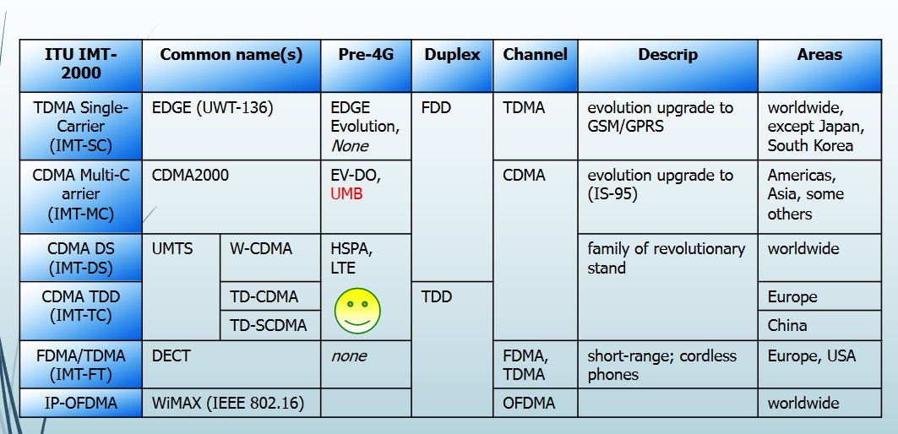

# Cellular Generations
* 2G: GSM, CDMAOnE, TDMA
- speed limit for user: 120km/h
* 2.5G: GRPS
* 2.75G: EDGE (**e** symbol appear on the phone)
* 3G
- huge, slow jump from 2G (in NA, didn't see the market need in 2010, cell phone is not ready)
- circuit switching to packet switching
* 3.9G: LTE
* 4G: LTE Advanced

# 3G Vision
## Universal global roaming
* not reached

## multimedia
* increased data rates
- 384 kbps to 2mbps
## increased capacity
## approach

# International Standaridization
* ITU
* 3G Partnership Projects (3GPP & 3GPP2)

# W-CDMA
* bandwidth for per user: 5MHz
* Wideband Code Division Multiple Access
* each user get a unique code, uses the whole frequency
* get data: unique code x spreaded data
* upgraded from GSM

* faster upload speed, slower download speed

# 3GPP Architecture
* Node B: cell phone tower
- BTS in 2G
* data go SGSN, phone call go MSC (2G)

# HSPA and HSPA+
* High Speed Packet Access
- HSDPA (downlink)
- HSUPA (uplink)
* use of higher order modulation
- 16QAM in downlink instead of QPSK
* shorter
## dual carrier
* connect to multiple towers, get benifits from all tower

# 4G
* tower can communicate with each other

# LTE (Long Term Evolution)
* not the true 4G
* upgrade from HSPA+
* a full IP network architecture
* support voice in the packet domain
* no need to divide phone call and data, all go through the same gateway
## Capabilities
* downlink peak: 326 Mbps with 20 MHz bandwidth
* uplink peak: 86,4 Mbps with 20 MHz bandwidth
* operation with both TDD and FDD modes
* scalable bandwidth: 1.4 MHz, 3 MHz, 5 MHz...
## Key technologies
* is an assortment of state-of-the-art technologies
## fixed wireless
* household 
* IEEE 802.16m: not for cellular system, for data system only

# LTE advanced
* almost the same architecture with LTE